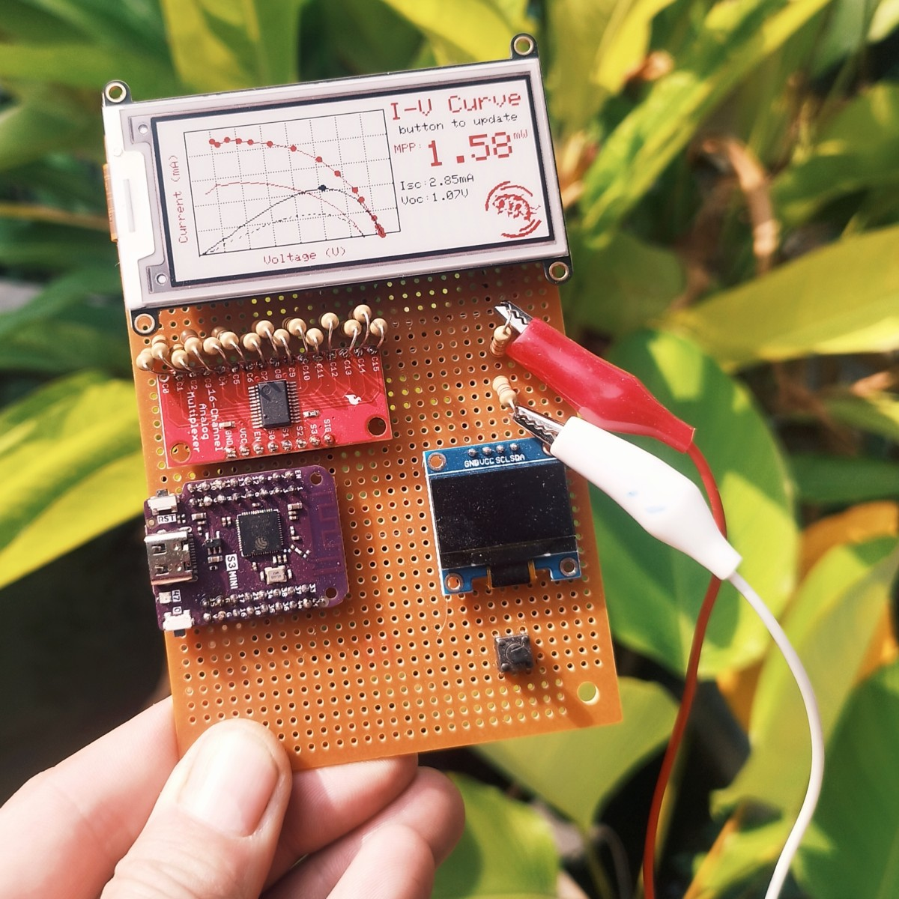

# Hardware Design Files

This directory contains the hardware design files for the I-V Curve Analyzer project, including detailed assembly instructions and PCB design files.

*The e-ink display shows the current measurement in dark contrast while the previous measurement is shown in lighter contrast for easy comparison.*

## Directory Structure

- [`HARDWARE.md`](HARDWARE.md) - Detailed assembly instructions and wiring guide
- [`MUX-ADG706/`](MUX-ADG706/) - KiCad project files for the PCB design of the MUX

## PCB Design Overview

The PCB design is implemented in KiCad and features several key improvements over the prototype version:

### Multiplexer Upgrade
The main improvement is the replacement of the CD74HC4067 with the ADG706BRUZ-REEL7 multiplexer:

- Significantly lower ON resistance (~2.5Ω vs 70Ω in the CD74HC4067)
- Better channel-to-channel matching for more consistent measurements
- 28-pin SOP package for compact board layout

### Project Files
The KiCad project (`MUX-ADG706/`) contains:

- [`MUX-ADG706.kicad_sch`](MUX-ADG706/MUX-ADG706.kicad_sch) - Complete circuit schematic
- [`MUX-ADG706.kicad_pcb`](MUX-ADG706/MUX-ADG706.kicad_pcb) - PCB layout design
- [`gerber_MUX-ADG706.zip`](MUX-ADG706/gerber_MUX-ADG706.zip) - Gerber files for PCB manufacturing

### Component Library
The [`ad706/`](MUX-ADG706/ad706/) directory contains all necessary files for the ADG706 multiplexer:

- [`ADG706BRUZ-REEL7.kicad_sym`](MUX-ADG706/ad706/ADG706BRUZ-REEL7.kicad_sym) - KiCad symbol file
- [`SOP65P640X120-28N.kicad_mod`](MUX-ADG706/ad706/SOP65P640X120-28N.kicad_mod) - Footprint for the 28-pin SOP package
- [`ADG706BRUZ-REEL7.step`](MUX-ADG706/ad706/ADG706BRUZ-REEL7.step) - 3D model for visualization

## Design Goals

1. Improve measurement accuracy through lower multiplexer resistance
2. Maintain compact form factor
3. Ensure reliable connections for workshop use
4. Enable precise I-V curve measurements for solar cells and other low-power sources
5. Provide persistent measurement display through e-ink technology

## Display System

The device features a dual-display system:
- **OLED Display**: For real-time measurement data and device status
- **E-ink Display (2.9" Adafruit IL0373)**: For persistent measurement visualization
  - Shows current and previous I-V curves for comparison
  - Maintains display even when powered off
  - High contrast for outdoor readability

## Future Considerations

- Consider adding test points for easier debugging
- Evaluate thermal considerations for continuous operation
- Explore data logging capabilities for long-term studies
